# 🎮 2048 Game Deployment on AWS EKS with Fargate & ALB Ingress

> Deploy the classic **2048 game** on Amazon EKS using **AWS Fargate** (serverless compute) and expose it to the internet via an **Application Load Balancer (ALB)** using the AWS Load Balancer Controller.

---

## 🎯 Final Result — 2048 Game Live on AWS

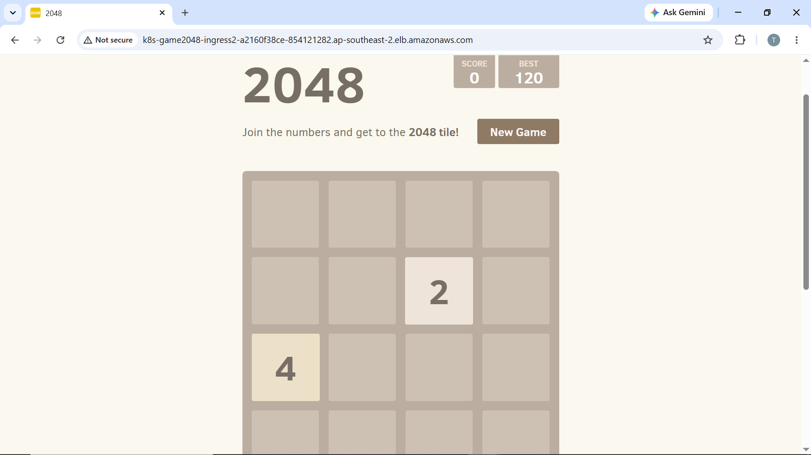

---

## 🏗️ Architecture Overview

```
┌─────────────────────────────────────────────────────────────┐
│                        Internet                             │
└─────────────────────┬───────────────────────────────────────┘
                      │
                      ▼
┌─────────────────────────────────────────────────────────────┐
│          Application Load Balancer (ALB)                    │
│   k8s-game2048-ingress2-a2160f38ce.ap-southeast-2.elb      │
└─────────────────────┬───────────────────────────────────────┘
                      │  Ingress (ALB)
                      ▼
┌─────────────────────────────────────────────────────────────┐
│           EKS Cluster: project-cluster (K8s 1.34)           │
│                 Region: ap-southeast-2                      │
│                                                             │
│  ┌──────────────────────────────────────────────────────┐   │
│  │           Namespace: game-2048                       │   │
│  │   Deployment: deployment-2048  (5 replicas)          │   │
│  │   Service: service-2048        (NodePort :80)        │   │
│  │   Ingress: ingress-2048        (ALB class)           │   │
│  └──────────────────────────────────────────────────────┘   │
│                                                             │
│  ┌──────────────────────────────────────────────────────┐   │
│  │           Namespace: kube-system                     │   │
│  │   aws-load-balancer-controller  (2 replicas)         │   │
│  │   coredns                       (2 replicas)         │   │
│  └──────────────────────────────────────────────────────┘   │
│                                                             │
│       Compute: AWS Fargate (Serverless — 11 Nodes)          │
└─────────────────────────────────────────────────────────────┘
                      │
                      ▼
┌─────────────────────────────────────────────────────────────┐
│       VPC: eksctl-project-cluster-cluster/VPC               │
│       CIDR: 192.168.0.0/16                                  │
│       6 Subnets (3 Public + 3 Private) across 3 AZs         │
│       Internet Gateway + NAT Gateway                        │
└─────────────────────────────────────────────────────────────┘
```

---

## 🛠️ Tech Stack

| Tool | Purpose |
|------|---------|
| **Amazon EKS** | Managed Kubernetes cluster |
| **AWS Fargate** | Serverless pod compute (no EC2 to manage) |
| **AWS ALB** | Application Load Balancer for internet access |
| **AWS Load Balancer Controller** | Manages ALB lifecycle from Kubernetes |
| **IRSA** | IAM Roles for Service Accounts (secure access) |
| **eksctl** | CLI to create/manage EKS clusters |
| **kubectl** | Kubernetes CLI |
| **Helm** | Package manager (used to install ALB controller) |

---

## 📋 Prerequisites

- AWS CLI configured with admin permissions
- [`eksctl`](https://eksctl.io/) installed
- [`kubectl`](https://kubernetes.io/docs/tasks/tools/) installed
- [`helm`](https://helm.sh/docs/intro/install/) installed

---

## 🚀 Step-by-Step Implementation

### Step 1 — Create EKS Cluster with Fargate

```bash
eksctl create cluster \
  --name project-cluster \
  --region ap-southeast-2 \
  --fargate
```

### Step 2 — Update kubeconfig

```bash
aws eks update-kubeconfig \
  --name project-cluster \
  --region ap-southeast-2
```

### Step 3 — Create Fargate Profile for game-2048 Namespace

```bash
eksctl create fargateprofile \
  --cluster project-cluster \
  --region ap-southeast-2 \
  --name alb-sample-app \
  --namespace game-2048
```

### Step 4 — Deploy the 2048 Application

```bash
kubectl apply -f https://raw.githubusercontent.com/kubernetes-sigs/aws-load-balancer-controller/v2.5.4/docs/examples/2048/2048_full.yaml
```

This creates: Namespace `game-2048`, Deployment (5 replicas), Service (NodePort), and Ingress.

### Step 5 — Set Up AWS Load Balancer Controller

#### 5a. Download & Create IAM Policy

```bash
curl -O https://raw.githubusercontent.com/kubernetes-sigs/aws-load-balancer-controller/v2.5.4/docs/install/iam_policy.json

aws iam create-policy \
  --policy-name AWSLoadBalancerControllerIAMPolicy \
  --policy-document file://iam_policy.json
```

#### 5b. Associate OIDC Identity Provider

```bash
eksctl utils associate-iam-oidc-provider \
  --cluster project-cluster \
  --approve
```

#### 5c. Create IAM Service Account (IRSA)

```bash
eksctl create iamserviceaccount \
  --cluster=project-cluster \
  --namespace=kube-system \
  --name=aws-load-balancer-controller \
  --role-name AmazonEKSLoadBalancerControllerRole \
  --attach-policy-arn=arn:aws:iam::<YOUR_ACCOUNT_ID>:policy/AWSLoadBalancerControllerIAMPolicy \
  --approve
```

#### 5d. Install ALB Controller via Helm

```bash
helm repo add eks https://aws.github.io/eks-charts
helm repo update eks

helm install aws-load-balancer-controller eks/aws-load-balancer-controller \
  -n kube-system \
  --set clusterName=project-cluster \
  --set serviceAccount.create=false \
  --set serviceAccount.name=aws-load-balancer-controller
```

---

## ✅ Verification Screenshots

### 1. EKS Cluster — Active in AWS Console
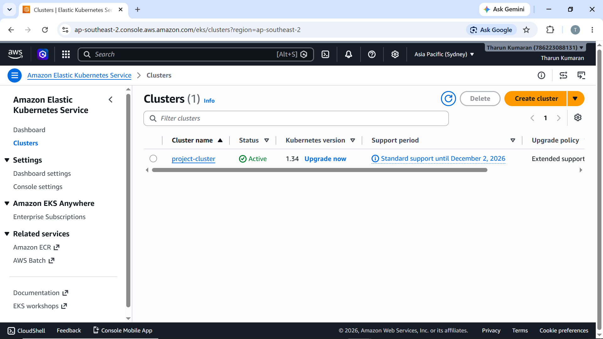

---

### 2. VPC Details — Created by eksctl
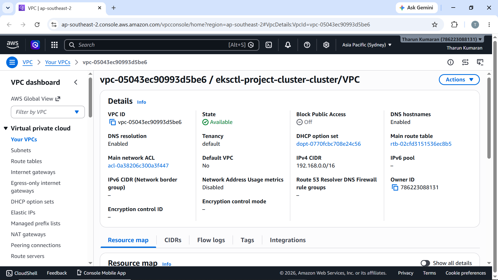

---

### 3. VPC Subnets — 6 Subnets across 3 AZs (Public + Private)
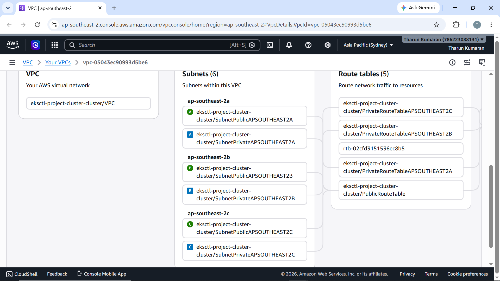

---

### 4. VPC Network Connections — Internet Gateway + NAT Gateway
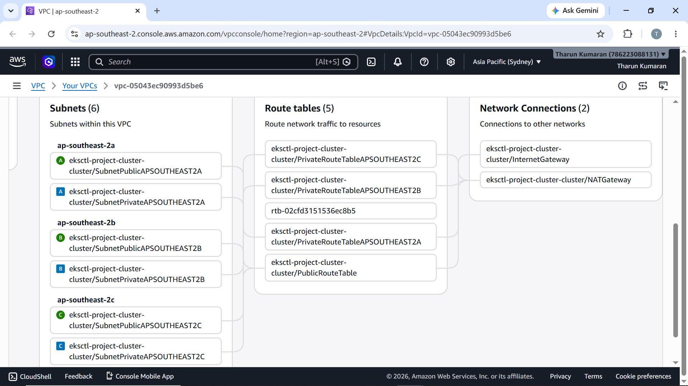

---

### 5. Fargate Profiles — alb-sample-app, fp-default (default & kube-system)
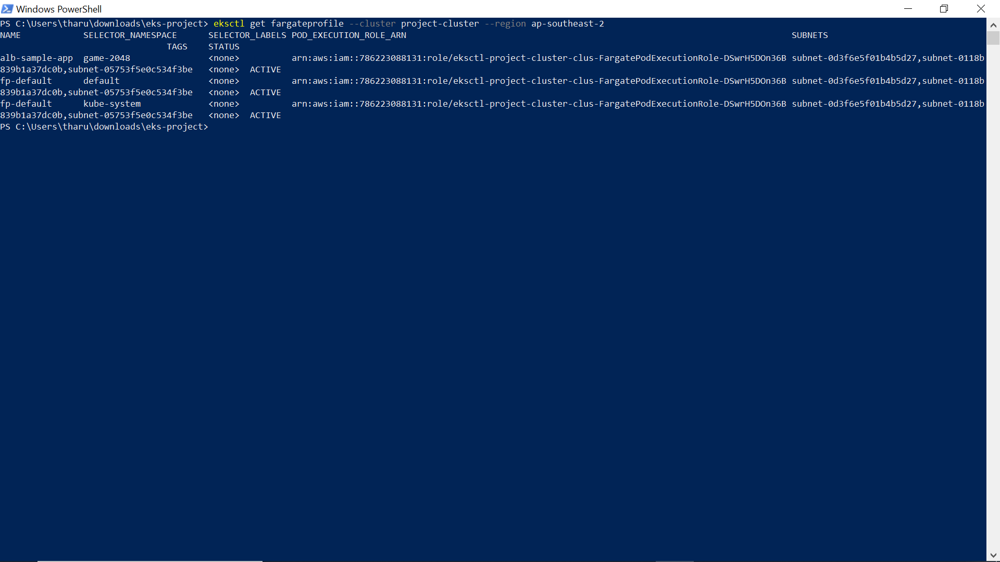

---

### 6. OIDC Provider Setup — for IRSA
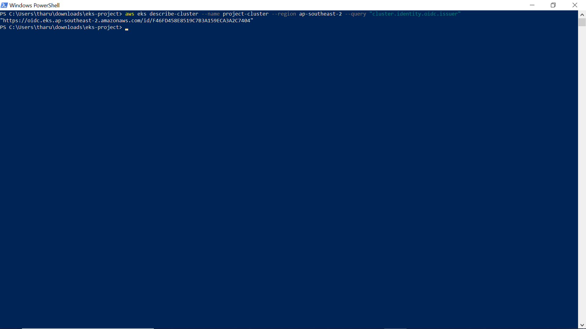

---

### 7. IAM Roles — AmazonEKSLoadBalancerControllerRole Created
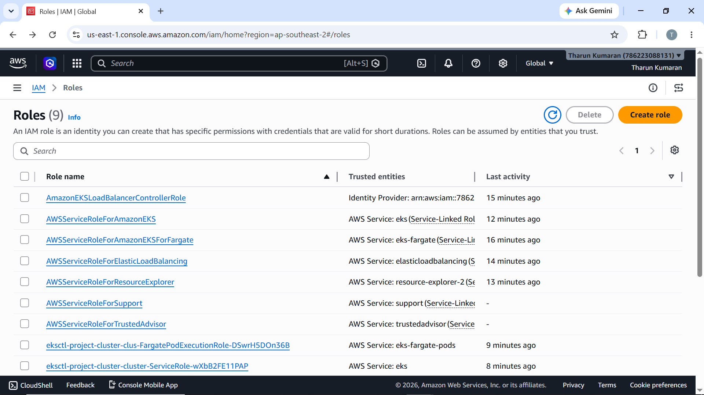

---

### 8. ALB Controller IAM Role — Policy Attached
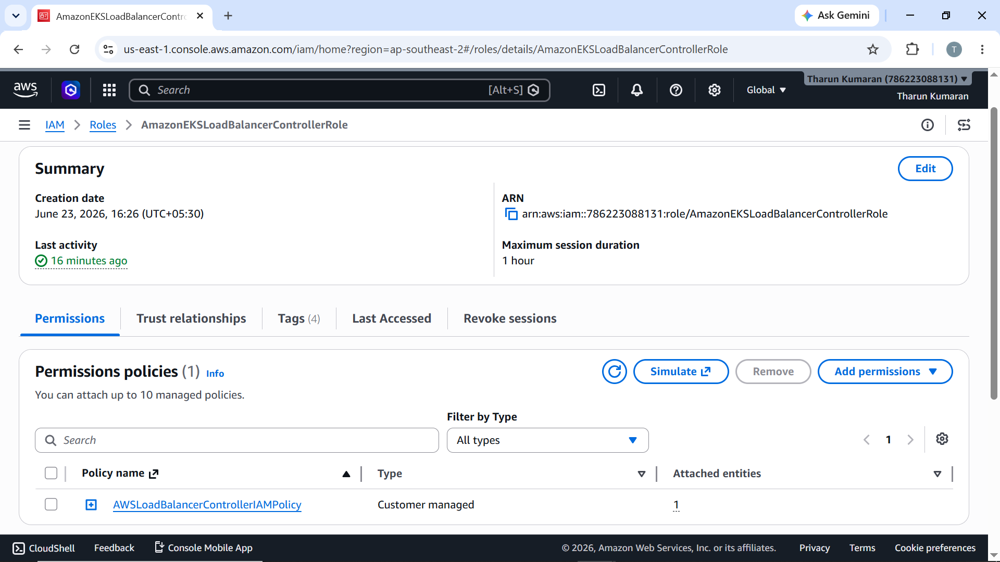

---

### 9. ALB Controller Deployment — 2/2 Running in kube-system
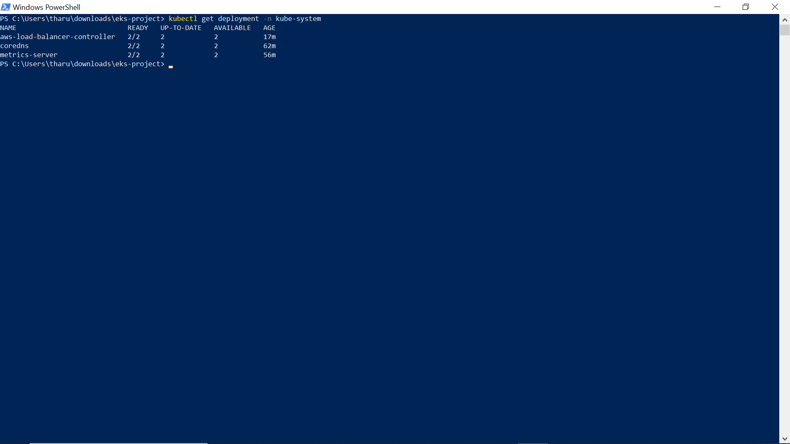

---

### 10. All Pods Running — game-2048 + kube-system
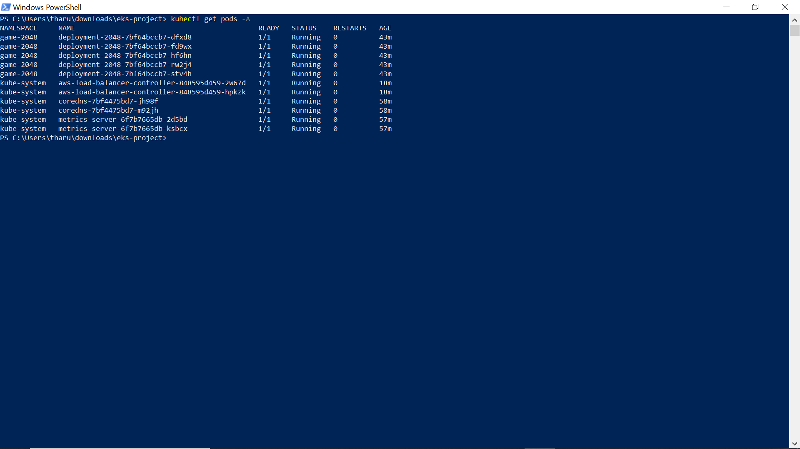

---

### 11. game-2048 Deployment — 5/5 Ready
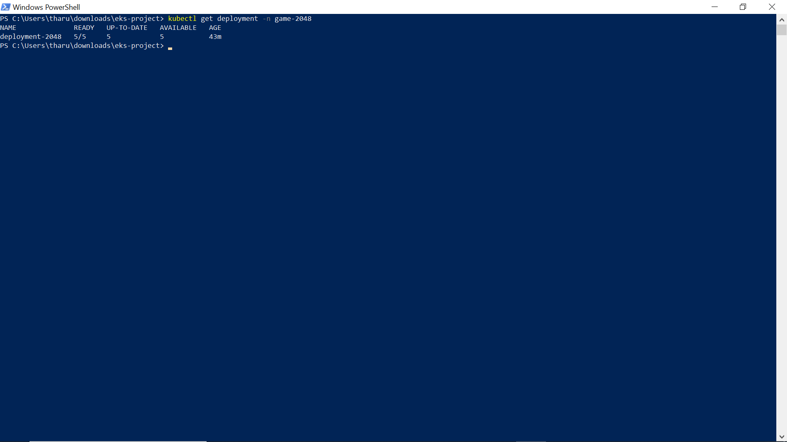

---

### 12. Ingress — ALB DNS Address Assigned
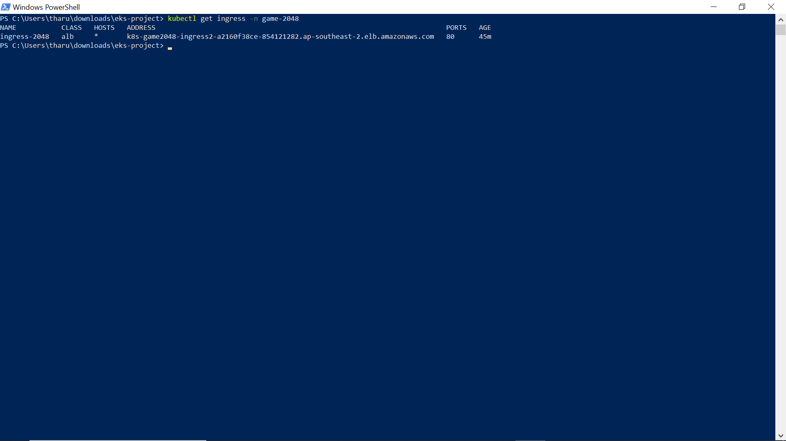

---

### 13. Fargate Nodes — 11 Nodes Ready in EKS Console
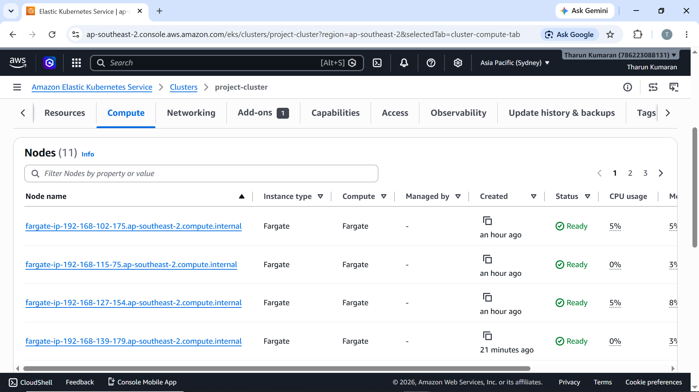

---

### 14. kubectl get all — Full Overview of game-2048 Namespace
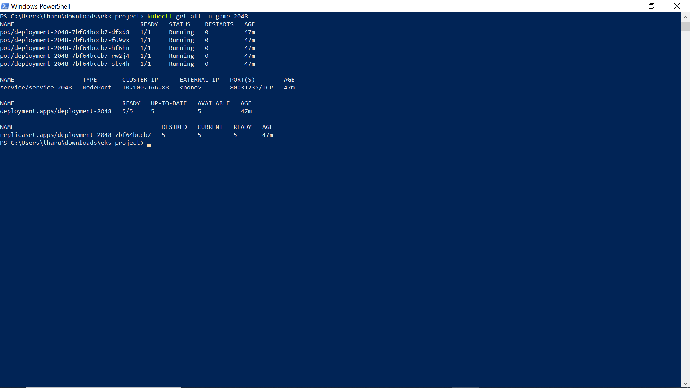

---

### 15. Application Load Balancer — Active in AWS Console
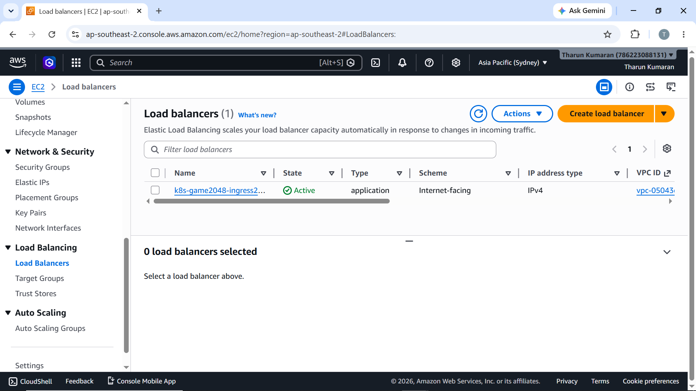

---

## 🌐 Accessing the Game

After the ingress provisions (wait 2–3 minutes after applying), open the ALB DNS in your browser:

```
http://<your-alb-dns>.ap-southeast-2.elb.amazonaws.com
```

Use **arrow keys** to move tiles. Merge tiles with the same number to reach **2048!**

---

## 🧹 Cleanup

To avoid ongoing AWS charges, delete the cluster and all associated resources:

```bash
eksctl delete cluster \
  --name project-cluster \
  --region ap-southeast-2
```

> ⚠️ This automatically removes: EKS cluster, Fargate profiles, VPC, subnets, NAT Gateway, Internet Gateway, and the ALB.

---

## 📚 References

- [AWS Load Balancer Controller Docs](https://kubernetes-sigs.github.io/aws-load-balancer-controller/)
- [eksctl Documentation](https://eksctl.io/)
- [Amazon EKS Fargate](https://docs.aws.amazon.com/eks/latest/userguide/fargate.html)
- [2048 Game Source](https://github.com/gabrielecirulli/2048)

---

## 👤 Author

**Tharun Kumaran**
Aspiring DevOps Engineer | AWS | Kubernetes | EKS | Fargate
